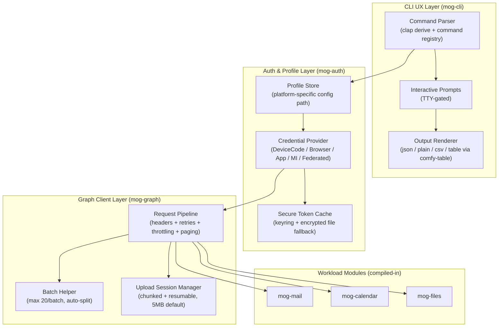
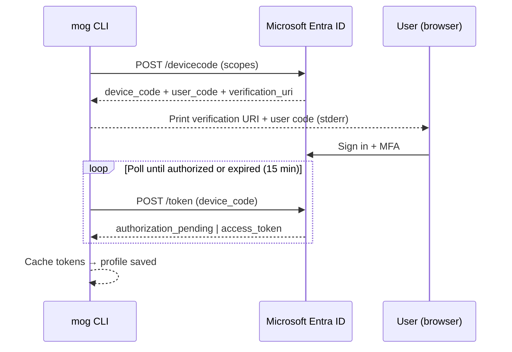
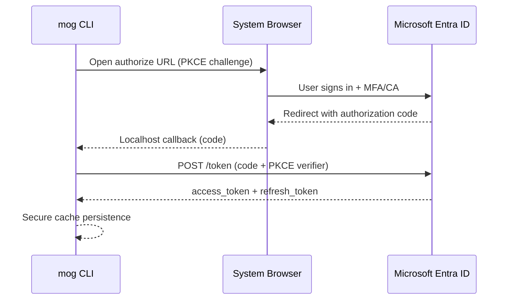
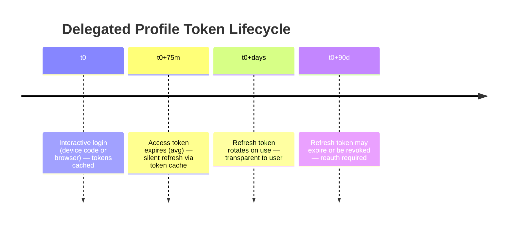

# Application Specification: `mog` — A gog-like CLI for Microsoft 365

## Executive Summary

`mog` is a cross-platform CLI written in **Rust** that provides gog-style ergonomics (consistent command taxonomy, JSON-first output, multi-account switching, least-privilege auth, stdout/stderr discipline) for Microsoft 365 workloads via Microsoft Graph. It ships as a statically-linked single binary and targets everyday mail, calendar, files, and directory workflows for both humans and automation.

## Non-Goals

This CLI explicitly does **not** aim to:

- Replace SharePoint administration tools (site collections, web parts, hub sites, term stores)
- Manage Exchange transport rules, mail flow, or mailbox policies
- Provide Microsoft Teams messaging, channels, or team management (complex permission model, tenant-level governance constraints, and RSC requirements make this better served by dedicated tooling)
- Provide Intune/endpoint device management or compliance policy configuration
- Cover Power Platform (Power Apps, Power Automate, Power BI administration)
- Manage Azure AD B2C or external identity scenarios
- Provide Security & Compliance Center administration (DLP, retention, eDiscovery)
- Replace Microsoft 365 Admin Center for tenant-level configuration
- Manage Viva, Yammer/Engage, or Bookings workloads

These may be added as optional modules in future releases but are out of scope for this specification.

## MVP Scope

The minimum viable first release includes:

| Module | Capabilities |
|---|---|
| **auth** | Device code, browser (PKCE), client credentials, managed identity, federated identity. Profile CRUD, token cache, scope bundles, `explain-permissions`. |
| **mail** | List (headers only by default), search (`$search`/KQL), read (full body), send (with attachments), download attachments. |
| **calendar** | Day/week view (`calendarView`), create/update/delete single events. Recurrence is read-only (expanded occurrences via calendarView). |
| **files** | List, search, download, upload (including resumable large upload with 5MB default chunk size), format conversion. |
| **graph** | Raw Graph call escape hatch (`mog graph call`). |
| **config** | Show/set configuration, profile management. |
| **version** | Version and build info. |

Post-MVP modules (see [roadmap.md](roadmap.md)): `contacts`, `people`, `tasks`, `directory`.

## Baseline: gog CLI Patterns to Replicate

| Pattern | gog Behavior | M365 Equivalent |
|---|---|---|
| Unified tool | Single binary spanning Google Workspace services | Single CLI spanning Outlook, OneDrive, Calendar, Entra, To Do |
| Multi-account | Profiles, aliases, `DEFAULT_ACCOUNT` env var | Profiles (account + tenant + cloud + auth strategy + scopes), `MOG_PROFILE` env var |
| Output discipline | Data → stdout, hints → stderr; `--json`, `--plain` | Identical. Never suppress stdout when not attached to TTY. |
| Global flags | `--account`, `--json`, `--plain`, `--force`, `--no-input` | Same, plus `--profile`, `--tenant`, `--output`, `--query` (v2), `--color` |
| Least privilege | `--services`, `--readonly`, scope narrowing | Scope bundle mapper (`--services mail,calendar --readonly`) |
| Secure storage | OS keyring with encrypted file fallback | MSAL-compatible secure token cache (OS keyring with encrypted file fallback) |
| Non-interactive | `--no-input` fails instead of prompting | Identical. TTY detection + `--no-input` override. |

## Language and Runtime

**Language:** Rust

**Rationale:** True single-binary distribution (no runtime dependency), excellent cross-compilation support, strong type system for API modeling, and native performance. Matches the "gog-like" goal of feeling like a single binary to users.

**Key crate selections:**

| Concern | Crate | Notes |
|---|---|---|
| CLI framework | `clap` (derive) | Command parsing, flag validation, shell completion generation |
| HTTP client | `reqwest` | async, TLS via `rustls` (vendored, no OpenSSL dependency) |
| JSON | `serde` + `serde_json` | Serialization/deserialization |
| OAuth/MSAL | Custom implementation or `oauth2` crate | No official MSAL for Rust; implement OAuth2 flows directly |
| Token cache encryption | `keyring` crate + platform APIs | DPAPI (Windows), Keychain (macOS), libsecret (Linux) |
| Table rendering | `comfy-table` | Terminal width detection, column truncation, Unicode handling |
| Async runtime | `tokio` | async I/O for concurrent Graph requests |
| Color output | `termcolor` or `owo-colors` | Respects `NO_COLOR`, `--color` flag, TTY detection |

**Repository structure:** Monorepo with internal crates (workspace members). Workload modules are separate crates within the workspace, compiled into the single binary.

```
mog/
├── Cargo.toml              # workspace root
├── crates/
│   ├── mog-cli/            # CLI entry point, command dispatch
│   ├── mog-auth/           # auth flows, token cache, profiles
│   ├── mog-graph/          # Graph client, retry, batching, pagination
│   ├── mog-mail/           # mail workload module
│   ├── mog-calendar/       # calendar workload module
│   ├── mog-files/          # files workload module
│   └── mog-core/           # shared types, errors, output rendering
├── tests/                  # integration tests
├── fixtures/               # HTTP recording/replay cassettes
└── scripts/
    └── Setup-MogAppReg.ps1 # App registration setup script
```

## Mapping to Microsoft 365 Capabilities

### Primary Integration Surface: Microsoft Graph

Graph v1.0 is the default API surface. Beta endpoints require an explicit `--api-version beta` flag.

#### API Versioning and Deprecation Strategy

| Version | Status | Support Policy |
|---|---|---|
| **v1.0** | Stable | Fully supported. Breaking changes only with 12-month notice. |
| **beta** | Preview | Subject to breaking changes without notice. Use with caution. |

**Beta Endpoint Warnings:**
- When `--api-version beta` is used, emit a warning to stderr: "Warning: Using beta API. Endpoints may change without notice."
- Beta endpoints may expose additional PII or sensitive fields not present in v1.0
- Output redaction still applies to beta responses

**Deprecation Handling:**

Graph follows the Microsoft Graph Deprecation Policy:
- Deprecation announced minimum 12 months before removal
- Deprecated APIs return `Sunset` header with deprecation date
- The CLI should detect `Sunset` headers and emit warnings

```http
Sunset: Sun, 01 Jan 2026 00:00:00 GMT
Deprecation: true
```

When a deprecated endpoint is used:
1. Log warning with deprecation date and migration path
2. Suggest alternative endpoint if known
3. Continue operation (don't fail)

**client-request-id Requirements:**

Every Graph request must include:
- `client-request-id`: UUID v4 generated by CLI
- `User-Agent`: `mog/{version} ({platform})`

These headers enable Microsoft support to trace requests and assist with debugging.

### Feature Mapping

| Capability | Graph Endpoint | Required Permission (Delegated) | Required Permission (App-Only) | Notes |
|---|---|---|---|---|
| Mail list | `GET /me/messages` | `Mail.ReadBasic` | `Mail.Read.All` | Least-privilege list permission. Default output should use `$select` and avoid full body payloads. Note: Use `$select` to limit fields with `Mail.Read.All` in app-only scenarios. |
| Mail search/read | `GET /me/messages`, `$search`, `GET /me/messages/{id}` | `Mail.Read` | `Mail.Read` | `$search` supports KQL; targets from, subject, body by default. Max 1,000 results. Full-message reads require broader read access than basic listing. |
| Send mail | `POST /me/sendMail` or `POST /users/{id}/sendMail` | `Mail.Send` | `Mail.Send` | JSON or MIME payload; saves to Sent Items by default. Use `/users/{id}` for app-only. |
| Calendar view | `GET /me/calendarView?startDateTime=…&endDateTime=…` | `Calendars.Read` | `Calendars.Read` | Returns occurrences, exceptions, and single instances in range. Note: `Calendars.ReadBasic` does not exist in Graph. |
| Calendar create/update/delete | `POST /me/events`, `PATCH /me/events/{id}`, `DELETE /me/events/{id}` | `Calendars.ReadWrite` | `Calendars.ReadWrite` | Write operations require `Calendars.ReadWrite`; use `/users/{id}` for app-only. |
| File search | `GET /me/drive/root/search(q='{q}')` | `Files.Read` | `Files.Read.All` | Targets a drive hierarchy. Use `/drives/{id}` or `/users/{id}/drive` for app-only. |
| Download file | `GET /drive/items/{id}/content` | `Files.Read` | `Files.Read.All` | Only DriveItems with `file` facet. |
| Convert to PDF | `GET /drive/items/{id}/content?format=pdf` | `Files.Read` | `Files.Read.All` | Conversion depends on source file type. |
| Resumable upload | `POST /me/drive/items/{parent-id}:/{name}:/createUploadSession` | `Files.ReadWrite` | `Files.ReadWrite.All` | Chunked upload with resume-on-failure. Default 5MB chunks, configurable via `--chunk-size`. Use `/drives/{id}` or `/users/{id}/drive` paths for app-only. |
| Contacts list | `GET /me/contacts` | `Contacts.Read` | `Contacts.Read` | Post-MVP. |
| People lookup | `GET /me/people` | `People.Read` | `People.Read.All` | Post-MVP. |
| To Do tasks | `GET /me/todo/lists/{id}/tasks` | `Tasks.Read` | `Tasks.Read.All` | Post-MVP. |
| Sites search | `GET /sites?search=…` | `Sites.Read.All` | `Sites.Read.All` | Full enumeration is admin-level. |
| Users/directory | `GET /users` | `User.ReadBasic.All` | `User.Read.All` | Post-MVP. `$search` requires `ConsistencyLevel: eventual`. |

### Graph API Query Parameters and Headers

The CLI must handle the following Graph API-specific requirements:

#### Required Headers for Search Queries

Directory queries using `$search` (users, groups) require the `ConsistencyLevel: eventual` header:

```http
GET /users?$search="displayName:John"
ConsistencyLevel: eventual
```

Without this header, the search returns 400 Bad Request with `Request_UnsupportedQuery`.

#### $count for Collection Validation

Use `$count=true` to get collection size without retrieving all items:

```bash
mog mail list --count-only  # Returns total count via odata.count
```

#### Delta Query Support

For synchronization scenarios, the CLI supports delta queries via the `--delta` flag:

```bash
# Initial delta request
mog mail list --delta --json > initial.json

# Subsequent delta using deltaLink from previous response
mog mail list --delta --delta-token "<deltaLink>" --json > changes.json
```

Delta tokens are valid for approximately 7 days. The CLI stores the last delta token per workload in the profile state.

#### $expand for Related Data

Common expansions should be supported for efficient data retrieval:

| Expansion | Use Case | Example |
|---|---|---|
| `attachments` | Include attachments in message list | `mog mail list --expand attachments` |
| `extensions` | Include open type extensions | `mog mail read <id> --expand extensions` |
| `calendar` | Include calendar in event | `mog calendar list --expand calendar` |

**Note:** Using `$expand` can significantly increase response size and should be used judiciously.

#### OData NextLink Handling

The CLI must properly handle `@odata.nextLink` for pagination. Some endpoints return relative URLs, others return absolute URLs. The client should normalize these to absolute URLs before following.

## Architecture

### Component Diagram



### Dependency Flow

```
CLI UX Layer (mog-cli)
  └─► Auth & Profile Layer (mog-auth) — profile resolution → credential acquisition
        └─► Graph Client Layer (mog-graph) — authenticated HTTP pipeline
              └─► Workload Modules (mog-mail, mog-calendar, mog-files)
```

- **CLI UX Layer** depends on Auth (for profile resolution) and Workload Modules (for command dispatch).
- **Auth & Profile Layer** has no upward dependencies. Provides `async fn get_token(scopes: &[&str]) -> Result<String>` to Graph Client.
- **Graph Client Layer** depends only on Auth (for tokens). Provides `async fn request(method, path, options) -> Result<Response>` to Workload Modules.
- **Workload Modules** depend on Graph Client. Zero cross-dependencies between modules.

### Workload Module Interface Contract

> **Note:** The interface contract below is illustrative. The TypeScript example from early design exploration needs to be translated to idiomatic Rust traits. This is a **pre-implementation research task** — the final trait design should be informed by the actual Graph API surface required for MVP modules. See the research task in the roadmap.

Each workload module must:

1. **Implement a registration trait** that adds commands to the CLI command registry.
2. **Declare required scopes** per command via metadata.
3. **Accept a `GraphClient` reference** (injected by the framework) — never construct HTTP clients directly.
4. **Return structured data types** — the output renderer handles formatting.
5. **Return typed errors** (`GraphApiError`, `AuthError`, `ValidationError`) — the framework handles display and exit codes.

```rust
// Illustrative module contract — final design TBD after Graph API surface research
use async_trait::async_trait;

#[async_trait]
pub trait WorkloadModule {
    /// Module name (e.g., "mail", "calendar", "files")
    fn name(&self) -> &str;

    /// Register commands with the CLI via clap subcommands
    fn register_commands(app: clap::Command) -> clap::Command;

    /// Map of command name → required OAuth scopes
    fn required_scopes(&self) -> HashMap<&str, Vec<&str>>;
}

// Example: mail module
pub struct MailModule;

#[async_trait]
impl WorkloadModule for MailModule {
    fn name(&self) -> &str { "mail" }

    fn required_scopes(&self) -> HashMap<&str, Vec<&str>> {
        HashMap::from([
            ("mail list", vec!["Mail.ReadBasic"]),
            ("mail send", vec!["Mail.Send"]),
            ("mail search", vec!["Mail.Read"]),
            ("mail read", vec!["Mail.Read"]),
            ("mail attachments download", vec!["Mail.Read"]),
        ])
    }

    fn register_commands(app: clap::Command) -> clap::Command {
        // ... clap subcommand registration
        app
    }
}
```

### Configuration

#### Profile Store

Default locations (override via `MOG_CONFIG_DIR` env var):

| Platform | Profile Store Path |
|---|---|
| Windows | `%LOCALAPPDATA%\mog\profiles.json` |
| macOS | `~/.config/mog/profiles.json` |
| Linux | `~/.config/mog/profiles.json` |

```json
{
  "$schema": "https://mog.dev/schemas/profiles.v1.json",
  "version": 1,
  "defaultProfile": "work",
  "profiles": {
    "work": {
      "tenantId": "contoso.onmicrosoft.com",
      "clientId": "xxxxxxxx-xxxx-xxxx-xxxx-xxxxxxxxxxxx",
      "authStrategy": "device-code",
      "cloud": "public",
      "scopeBundles": ["mail:read", "calendar:read"],
      "apiVersion": "v1.0"
    },
    "automation": {
      "tenantId": "xxxxxxxx-xxxx-xxxx-xxxx-xxxxxxxxxxxx",
      "clientId": "xxxxxxxx-xxxx-xxxx-xxxx-xxxxxxxxxxxx",
      "authStrategy": "client-credentials",
      "cloud": "public",
      "certificatePath": "/path/to/cert.pem",
      "certificateFormat": "pem",
      "apiVersion": "v1.0"
    }
  }
}
```

**Supported `cloud` values:** `public`, `gcc`, `gcc-high`, `dod`, `china`.

> **Note:** Sovereign cloud presets (`gcc`, `gcc-high`, `dod`, `china`) are included in the auth layer with configurable authority and Graph base URLs. However, these are **untested in v1** and provided on a best-effort basis. Full sovereign cloud validation is deferred to a future release (see [roadmap.md](roadmap.md)).

**Supported `authStrategy` values:** `device-code`, `browser`, `client-credentials`, `managed-identity`, `federated`.

#### Global Config

Platform-specific config file locations:

| Platform | Config Path |
|---|---|
| Windows | `%LOCALAPPDATA%\mog\config.json` |
| macOS | `~/.config/mog/config.json` |
| Linux | `~/.config/mog/config.json` |

```json
{
  "output": {
    "defaultFormat": "table",
    "color": "auto",
    "pager": "less"
  },
  "graph": {
    "defaultApiVersion": "v1.0",
    "maxRetries": 3,
    "defaultPageSize": 25,
    "autoPaginate": true,
    "maxResults": 100,
    "batchSize": 20
  },
  "logging": {
    "level": "warn",
    "redactBodies": true
  }
}
```

### Exit Codes

| Code | Meaning |
|---|---|
| `0` | Success |
| `1` | General error (invalid arguments, command failure) |
| `2` | Authentication failure (expired token, consent required, invalid credentials) |
| `3` | Authorization failure (insufficient permissions / 403) |
| `4` | Resource not found (404) |
| `5` | Rate limited (429, all retries exhausted) |
| `6` | Network error (DNS failure, timeout, Graph unreachable) |
| `7` | Conflict (409) |
| `8` | User cancelled (SIGINT during interactive prompt) |
| `130` | SIGINT (standard convention) |

### Signal Handling

| Signal | Behavior |
|---|---|
| `SIGINT` (Ctrl+C) | **During interactive prompts:** cancel prompt, exit code 8. **During API calls:** cancel pending request, print partial results if any, exit code 130. **During upload sessions:** attempt to cancel the upload session on the server, print session ID for manual cleanup, exit code 130. **During batch operations:** cancel remaining requests, report completed/failed/cancelled counts. |
| `SIGTERM` | Graceful shutdown: cancel in-flight requests, flush logs, exit code 130. |
| `SIGPIPE` | Silently terminate (standard Unix behavior for piped output). |

On Windows, `Ctrl+C` and `Ctrl+Break` are handled via `SetConsoleCtrlHandler` with equivalent semantics to `SIGINT`/`SIGTERM`.

### Offline / Unreachable Graph Behavior

When Graph is unreachable (DNS failure, timeout, 503):

1. **Connection timeout:** 10 seconds.
2. **Retry with backoff** per the standard retry policy (up to `maxRetries`).
3. **On exhaustion:** print actionable error — "Cannot reach Microsoft Graph. Check network connectivity." — with the last HTTP status (or network error description), the request correlation IDs, and exit code 6.
4. **No implicit caching or queued operations.** The CLI is stateless by design — it does not cache API responses or queue writes for later replay. If a request fails, it fails.
5. **Exception:** Token cache is persisted locally. If the cached access token is still valid, auth succeeds even when Entra is unreachable (but Graph calls will still fail).

## Interactive CLI Specification

### CLI Principles

- **Data on stdout; hints on stderr.** Always.
- **Interactive by default when safe:** prompts allowed if stdin/stdout are TTY and `--no-input` is not set. Otherwise, fail fast with actionable errors.
- **Stable automation modes:** `--json` and `--plain` produce identical output regardless of TTY state.
- **Profiles as first-class objects.**

### Command Taxonomy

```
mog auth        — login/logout, profile CRUD, scope/consent management, token status
mog mail        — list/search/read/send, attachments download
mog calendar    — day/week views, create/update/delete single events
mog files       — list/search/download/upload/convert, permissions
mog graph       — raw Graph call escape hatch
mog config      — show/set configuration
mog version     — version info
```

Post-MVP (see [roadmap.md](roadmap.md)):
```
mog contacts    — list/search Outlook contacts
mog people      — relevant people lookup (People API)
mog tasks       — To Do lists/tasks CRUD
mog directory   — users/groups lookup
```

### Global Flags

| Flag | Description | Default |
|---|---|---|
| `--profile <name>` | Saved profile/connection to use | `MOG_PROFILE` env var, or `defaultProfile` from config |
| `--tenant <id\|domain>` | Tenant routing (overrides profile) | From profile |
| `--json` | JSON output | — |
| `--plain` | Stable plain-text output | — |
| `--output <json\|text\|csv\|table>` | Output format | `table` (interactive), `json` (non-interactive) |
| `--query <jmespath>` | Client-side JMESPath query (**v2 — not implemented in v1**; use `--json \| jq` instead) | — |
| `--force` | Skip destructive-action confirmations | `false` |
| `--no-input` | Never prompt; fail instead | Auto-set when no TTY |
| `--verbose` | Verbose logging to stderr | `false` |
| `--debug` | Full debug output including raw HTTP | `false` |
| `--trace` | JSON event per Graph call to stderr | `false` |
| `--api-version <v1.0\|beta>` | Graph API version | `v1.0` |
| `--top <n>` | Server-side `$top` parameter | `25` (command-specific overrides apply) |
| `--all` | Auto-paginate and return all results (⚠️ may be slow for large collections) | `false` |
| `--color <always\|never\|auto>` | Color output control | `auto` (TTY detection) |
| `--client-id <id>` | Override the default app registration client ID | Built-in default |

**Environment variables:**

| Variable | Description |
|---|---|
| `MOG_PROFILE` | Default profile name |
| `MOG_CONFIG_DIR` | Override config directory |
| `NO_COLOR` | Disable color output ([no-color.org](https://no-color.org) standard) |

Color behavior: When `--color auto` (default), color is enabled when stdout is a TTY and `NO_COLOR` is not set. `--color always` forces color even in pipes. `--color never` disables color unconditionally.

## Authentication

### App Registration

`mog` ships with a **pre-registered multi-tenant Azure AD application** (public client, no client secret). This allows users to `mog auth login` immediately without creating their own app registration. The application is publisher-verified to establish trust, and it requests only the minimum permissions required for MVP functionality. Organizations with strict security policies can create their own app registration using the provided setup script.

For organizations that require their own app registration, the `--client-id` global flag overrides the built-in default.

#### Setup Script: `Setup-MogAppReg.ps1`

A PowerShell setup script is provided at `scripts/Setup-MogAppReg.ps1` for organizations that want to create their own app registration. The script:

1. **Checks prerequisites:** Verifies `Az` PowerShell module is installed (installs if missing).
2. **Creates the app registration** in the target tenant as a public client (no secret).
3. **Configures redirect URIs:**
   - `http://localhost` (with dynamic port) for browser/PKCE flow
   - Device code flow does not require a redirect URI
4. **Configures API permissions:** Adds the minimum delegated permissions for MVP modules. Baseline set: `Mail.ReadBasic`, `Mail.Read`, `Mail.Send`, `Calendars.ReadBasic`, `Calendars.ReadWrite`, `Files.ReadWrite`, and `User.Read`. This covers both least-privilege list/view commands and broader read/write commands in the MVP.
5. **Outputs the client ID** for use with `--client-id` or profile configuration.

Usage:
```powershell
# Create app registration in your tenant
.\Setup-MogAppReg.ps1 -TenantId "contoso.onmicrosoft.com"

# Create with custom display name
.\Setup-MogAppReg.ps1 -TenantId "contoso.onmicrosoft.com" -AppName "mog - Contoso"
```

#### Release Prerequisite

The default multi-tenant app registration **must be created and published before v1 release**. Requirements:
- Public client (no client secret)
- Multi-tenant (`signInAudience: AzureADMultipleOrgs`)
- Redirect URIs: `http://localhost` (browser flow with dynamic port, PKCE)
- Pre-configured API permissions for MVP scope bundles
- Publisher verification completed

### Interactive Auth Strategies

#### Device Code Flow (Default)

Device code flow is designed for CLIs without a browser. The user receives a short-lived device code and verification URI, signs in via their own browser (MFA enforced by Entra policy), and the CLI polls for completion within a 15-minute window. This flow is resistant to phishing because the user must authenticate via the Microsoft Entra ID portal directly, not through a CLI-provided link. The device code is displayed only to the user and is never transmitted over the network except to the Entra token endpoint via secure TLS.

**Important:** Conditional Access policies can block device code flow. The CLI must detect this (error code `AADSTS50199` or `AADSTS7000218`) and suggest `--strategy browser` as fallback.



#### Interactive Browser Flow (Auth Code + PKCE)

For tenants blocking device code, the CLI opens the system browser for authorization code flow with PKCE (Proof Key for Code Exchange). This provides enhanced security by preventing authorization code interception attacks. A localhost redirect (dynamic port) captures the auth code, which is secure against network eavesdropping as the callback stays on the local machine. The CLI validates the redirect URI matches the expected `http://localhost` origin and rejects any malicious redirect attempts.



### Non-Interactive Auth Strategies

#### Service Principal (Client Credentials)

```bash
# With client secret (discouraged — prefer certificate)
mog auth login --auth-type app --tenant <id> --client-id <id> --client-secret-stdin

# With PEM certificate (preferred — cross-platform)
mog auth login --auth-type app --tenant <id> --client-id <id> --certificate-file ./cert.pem

# With PFX certificate (Windows environments)
mog auth login --auth-type app --tenant <id> --client-id <id> --certificate-file ./cert.pfx
```

**Certificate format support:**
- **PEM** (`.pem`): Primary format. Cross-platform, text-based, widely supported. Contains the private key and certificate chain.
- **PFX/PKCS#12** (`.pfx`, `.p12`): Supported for Windows environments. Binary format, may be password-protected (use `--certificate-password-stdin` if needed).

Format is auto-detected from file extension. Use `--certificate-format pem|pfx` to override.

No refresh token concept — reacquire on expiry.

#### Workload Identity Federation (Secretless CI/CD)

```bash
mog auth login --auth-type federated --tenant <id> --client-id <id> \
  --federated-token-file <path>
```

Designed for GitHub Actions OIDC, Kubernetes service accounts, and similar external identity providers. The federated token file should have restrictive permissions (0600) and be accessible only by the calling process. The CLI reads the token once and does not cache it persistently.

#### Managed Identity (Azure-Native)

Managed identity tokens are acquired securely via the Azure Instance Metadata Service (IMDS) over a local, non-routable endpoint (`169.254.169.254`). This provides secretless authentication without exposing credentials. Tokens have short lifetimes (typically 24 hours) and are automatically rotated by Azure.

```bash
# System-assigned
mog auth login --auth-type managed-identity

# User-assigned
mog auth login --auth-type managed-identity --client-id <user-assigned-mi-client-id>
```

Requests tokens for the cloud-specific Graph resource `/.default` scope:
- `https://graph.microsoft.com/.default` for `public` and `gcc`
- `https://graph.microsoft.us/.default` for `gcc-high`
- `https://dod-graph.microsoft.us/.default` for `dod`
- `https://microsoftgraph.chinacloudapi.cn/.default` for `china`

Managed identity and client-credentials flows acquire application permissions. Commands implemented on delegated-only `/me/...` routes must be translated to resource-specific routes such as `/users/{id}`, `/drives/{id}`, or `/sites/{id}` when running app-only.

### Consent and Scope Management

The CLI uses a **scope bundle mapper** to translate human-friendly service names to Graph permissions. Scope bundles are **hardcoded** in the binary with a version-bumped mapping. They are not user-configurable — this prevents misconfiguration and ensures consistent behavior.

#### Full Scope Bundle Mapping


| Bundle | Delegated Scopes | App-Only Scopes | Example Command | Security Context
|---|---|---|---|
| `mail:basic` | `Mail.ReadBasic` | `Mail.Read.All` | `mog mail list` |
| `mail:read` | `Mail.Read` | `Mail.Read` | `mog mail read` / `mog mail search` |
| `mail:send` | `Mail.Send` | `Mail.Send` | `mog mail send` |
| `mail` | `Mail.Read`, `Mail.Send` | `Mail.Read`, `Mail.Send` | — |
| `calendar:basic` | `Calendars.Read` | `Calendars.Read` | `mog calendar today` / `mog calendar week` |
| `calendar:read` | `Calendars.Read` | `Calendars.Read` | Reserved for future commands that require full event bodies or richer read access |
| `calendar` | `Calendars.ReadWrite` | `Calendars.ReadWrite` | `mog calendar create` |
| `files:read` | `Files.Read` | `Files.Read.All` | `mog files list` |
| `files` | `Files.ReadWrite` | `Files.ReadWrite.All` | `mog files upload` |
| `tasks:read` | `Tasks.Read` | `Tasks.Read.All` | `mog tasks list` (post-MVP) |
| `tasks` | `Tasks.ReadWrite` | `Tasks.ReadWrite.All` | `mog tasks create` (post-MVP) |
| `contacts:read` | `Contacts.Read` | `Contacts.Read` | `mog contacts list` (post-MVP) |
| `people:read` | `People.Read` | `People.Read.All` | `mog people search` (post-MVP) |
| `directory:read` | `User.ReadBasic.All` | `User.Read.All` | `mog directory users` (post-MVP) |
| `user` | `User.Read` | — | Implicit for all delegated flows |

### Scope Escalation Policy

**Scope escalation policy:** If a command requires scopes not in the active token:
1. Emit a clear error listing missing scopes.
2. Print a remediation command: `mog auth login --add-scopes <missing>`.
3. If interactive, offer to re-consent (unless `--no-input`).

**Consent permanently denied:** When a tenant admin has permanently blocked required permissions:
1. Clear error explaining which permission is missing and why it's needed for the requested operation.
2. Print the admin consent URL: `mog auth admin-consent-url`.
3. Explain that tenant admin action is required to grant the permission.
4. Exit code 3.

### Tenant Selection

- `--tenant common` — broad login (multi-tenant apps)
- `--tenant <GUID>` or `--tenant <domain>` — tenant-bound
- `mog auth status` — shows tenant, account, cloud, scopes, expiry, auth strategy

### Cloud Endpoints

| Cloud | Authority | Graph Endpoint |
|---|---|---|
| `public` | `login.microsoftonline.com` | `graph.microsoft.com` |
| `gcc` | `login.microsoftonline.com` | `graph.microsoft.com` |
| `gcc-high` | `login.microsoftonline.us` | `graph.microsoft.us` |
| `dod` | `login.microsoftonline.us` | `dod-graph.microsoft.us` |
| `china` | `login.chinacloudapi.cn` | `microsoftgraph.chinacloudapi.cn` |

`gcc` intentionally uses the global Microsoft Entra and Graph endpoints. Only GCC High and DoD use the US Government endpoints.

> **v1 Note:** The auth layer supports configurable authority and Graph base URLs. Cloud presets are included but **untested in v1**. Full sovereign cloud validation is deferred (see [roadmap.md](roadmap.md)).

### Token Caching

- **Silent-first acquisition:** Always attempt cache-first; fall back to interactive only on UI-required errors.
- **Secure persistence:** OS keyring integration with encrypted file fallback for headless environments.
- **Access tokens:** 60–90 minute lifetime (randomly assigned at issuance). Cannot be revoked; valid until expiry.
- **Refresh tokens:** ~90-day default lifetime. Rotate on use. Can be revoked (triggers reauth).

#### Token Cache Locations

| Platform | Cache Path | Encryption |
|---|---|---|
| Windows | `%LOCALAPPDATA%\mog\token_cache.bin` | DPAPI |
| macOS | Keychain (`mog-token-cache` service) | Keychain encryption |
| Linux | `~/.mog/token_cache.bin` | libsecret (preferred), passphrase fallback |

### Token Lifecycle (Operational Model)



### Advanced Authentication Features

#### Continuous Access Evaluation (CAE)

The CLI supports CAE-enabled tokens, allowing for real-time revocation detection. When a CAE token is revoked (user disabled, location policy change, etc.), Graph returns a 401 with `WWW-Authenticate: Bearer error="insufficient_claims"`. The CLI must:

1. Detect CAE challenges via `WWW-Authenticate` header
2. Re-authenticate interactively (or fail with exit code 2 if `--no-input`)
3. Request a new CAE-enabled token

CAE tokens include the `xms_cc` claim indicating CAE support. The CLI should request CAE tokens by default for interactive flows.

#### PKCE Session Persistence

For browser flow (Auth Code + PKCE), the PKCE verifier must be persisted temporarily during the authentication flow:

1. Generate PKCE verifier and challenge at flow initiation
2. Store verifier in-memory only (never persist to disk)
3. Include challenge in authorization URL
4. Exchange verifier for tokens on callback
5. Zeroize verifier immediately after token exchange

**Timeout:** If callback doesn't occur within 5 minutes, discard the verifier and fail the flow.

#### Token Cache Serialization

Token cache uses MSAL-compatible serialization format (encrypted JSON). Cache schema version is tracked for migration support:

```json
{
  "version": 1,
  "accounts": [...],
  "access_tokens": [...],
  "refresh_tokens": [...],
  "id_tokens": [...]
}
```

Cache is locked during read/write operations to prevent corruption from concurrent CLI invocations.

## Mail Module

### `mog mail list`

Returns **headers only** by default: from, to, subject, date, and a short preview (first ~200 characters). This keeps output compact and API calls fast (uses `$select` to exclude body).

```bash
# Default: headers only
mog mail list --unread --since 7d --top 25

# Include full body (opt-in)
mog mail list --unread --since 7d --include-body --json
```

### `mog mail read <id>`

Returns the **full message** including body (HTML or text, controlled by `Prefer: outlook.body-content-type` header).

```bash
mog mail read <message-id> --json
mog mail read <message-id> --body-type text  # force plain text
```

### `mog mail search`

KQL search via `$search` parameter.

```bash
mog mail search --kql 'from:randiw AND hasAttachments:true' --top 25 --json
```

### `mog mail send`

```bash
mog mail send --to "user@contoso.com" --subject "Report" \
  --body-file ./message.txt --attach ./report.pdf
```

### Attachments

Attachments are listed as **metadata only** by default (name, size, content type, ID). Binary content is **never inlined** in JSON output.

```bash
# List attachments for a message
mog mail attachments list <message-id> --json

# Download all attachments to a directory
mog mail attachments download <message-id> --out-dir ./downloads

# Download a specific attachment
mog mail attachments download <message-id> --attachment-id <id> --out ./file.pdf
```

Output for `attachments list`:
```json
[
  {
    "id": "AAMk...",
    "name": "report.pdf",
    "contentType": "application/pdf",
    "size": 1048576
  }
]
```

## Calendar Module

### Views

```bash
# Today's events
mog calendar today --json

# This week
mog calendar week --json

# Custom range (uses calendarView — returns expanded occurrences)
mog calendar list --start 2025-01-01 --end 2025-01-31 --json
```

### Create/Update/Delete

```bash
# Create a single event
mog calendar create --subject "Team Standup" --start "2025-01-20T09:00" \
  --end "2025-01-20T09:30" --attendees "user@contoso.com"

# Update
mog calendar update <event-id> --subject "Updated Subject"

# Delete
mog calendar delete <event-id>
```

### Recurrence (Read-Only in v1)

Recurring events are displayed as **expanded individual occurrences** via `calendarView`. The `seriesMasterId` is included in output for reference. **Creating recurring events is not supported in v1** — see [roadmap.md](roadmap.md) for the planned recurrence DSL.

## Files Module

```bash
# Search
mog files search --q "quarterly results" --top 10 --json

# Download
mog files download --item-id <id> --out ./file.bin

# Convert to PDF
mog files export --item-id <id> --format pdf --out ./file.pdf

# Resumable large upload (5MB chunks by default)
mog files upload --dest "/Shared/report.iso" --file ./report.iso --resumable

# Custom chunk size
mog files upload --dest "/Shared/large.zip" --file ./large.zip --resumable --chunk-size 10485760
```

### Upload Sessions

- **Default chunk size:** 5MB (5,242,880 bytes)
- **Configurable:** `--chunk-size <bytes>` (minimum 320KB per Graph requirement, maximum 60MB)
- **Resume-on-failure:** Upload session URL is printed to stderr on start. If interrupted, the session can be resumed within its expiry window (typically ~7 days).

## Raw Graph Escape Hatch

### `mog graph call`

Full interface for direct Graph API access:

```
mog graph call <VERB> <path> [flags]
```

| Flag | Description |
|---|---|
| `--top <n>` | Sets `$top` query parameter |
| `--select <fields>` | Sets `$select` query parameter |
| `--filter <expr>` | Sets `$filter` query parameter |
| `--header "Key: Value"` | Add custom request header (repeatable) |
| `--body-file <path>` | Request body from file |
| `--body-stdin` | Read request body from stdin |
| `--api-version <v1.0\|beta>` | Override API version for this call |

Examples:

```bash
# Simple GET
mog graph call GET /me/memberOf --json

# POST with body
mog graph call POST /me/sendMail --body-file ./payload.json

# With custom headers
mog graph call GET /me/messages --top 5 \
  --header "Prefer: outlook.body-content-type=text" --json

# PATCH with stdin body
echo '{"displayName": "New Name"}' | mog graph call PATCH /me --body-stdin

# Beta endpoint
mog graph call GET /me/profile --api-version beta --json
```

## Error Handling, Retries, and Rate Limits

### Graph Error Handling

Graph returns standard HTTP status codes with a JSON error body:

```json
{
  "error": {
    "code": "ErrorAccessDenied",
    "message": "Access is denied.",
    "innerError": {
      "request-id": "...",
      "client-request-id": "...",
      "date": "..."
    }
  }
}
```

### HTTP Status Code Handling

| Status | Handling | Exit Code |
|---|---|---|
| **400 Bad Request** | Malformed request. Print the Graph error code and message. Check for common issues (invalid `$filter` syntax, unsupported query parameters). | 1 |
| **401 Unauthorized** | Token expired or invalid. Attempt silent refresh once. If still 401, prompt for reauth (or fail with exit code 2 if `--no-input`). | 2 |
| **403 Forbidden** | Insufficient permissions. Print required scopes (from module metadata) and `mog auth explain-permissions <command>`. | 3 |
| **404 Not Found** | Resource doesn't exist. Print the resource path and suggest checking the ID. | 4 |
| **409 Conflict** | Concurrent modification. Print the conflict details and suggest retry. | 7 |
| **429 Too Many Requests** | Respect `Retry-After` header. If absent, exponential backoff: 1s → 2s → 4s → 8s → 16s (jitter ±20%). Max retries from config (`maxRetries`, default 3). | 5 (if exhausted) |
| **500 Internal Server Error** | Retry up to `maxRetries` with exponential backoff. | 1 |
| **502 Bad Gateway** | Retry up to `maxRetries` with exponential backoff. Likely a transient Graph infrastructure issue. | 5 (if exhausted) |
| **503 Service Unavailable** | Retry with backoff. Distinguish from network errors in output. | 5 (if exhausted) |
| **504 Gateway Timeout** | Retry with backoff. | 5 (if exhausted) |

### AADSTS Error Codes (Authentication)

| Error Code | Description | Handling |
|---|---|---|
| `AADSTS50076` | MFA required | Prompt for MFA completion (device code/browser). Exit code 2 if `--no-input`. |
| `AADSTS50079` | User must enroll in MFA | Display enrollment URL. Exit code 2. |
| `AADSTS50199` | Device code flow blocked by CA | Suggest `--strategy browser` fallback. Exit code 2. |
| `AADSTS7000218` | Device code flow disabled | Suggest `--strategy browser` fallback. Exit code 2. |
| `AADSTS7000114` | Invalid client ID | Check `--client-id` or profile configuration. Exit code 2. |
| `AADSTS7000222` | Invalid client secret | For app-only: secret expired or invalid. Exit code 2. |
| `AADSTS65001` | Consent required | Show `mog auth admin-consent-url` or prompt for consent. Exit code 2. |
| `AADSTS650057` | Invalid resource | The requested scope/resource doesn't exist. Exit code 2. |
| `invalid_grant` | Refresh token revoked/expired | Prompt for reauthentication. Exit code 2. |

### Graph-Specific Error Codes

| Error Code | HTTP Status | Description | Handling |
|---|---|---|---|
| `ErrorItemNotFound` | 404 | Item doesn't exist | Verify ID and retry. Exit code 4. |
| `ErrorInvalidIdMalformed` | 400 | Malformed object ID | Check ID format (should be base64url). Exit code 1. |
| `ErrorAccessDenied` | 403 | Insufficient permissions | Show required scopes. Exit code 3. |
| `ErrorQuotaExceeded` | 403 | Mailbox/storage quota exceeded | User action required. Exit code 3. |
| `ErrorInvalidRequest` | 400 | Invalid request parameters | Check command arguments. Exit code 1. |
| `ErrorPropertyValidationFailure` | 400 | Property value invalid | Show validation details. Exit code 1. |
| `ErrorNameAlreadyExists` | 409 | Conflict - name already exists | Suggest rename or update. Exit code 7. |
| `ErrorConflictOccurrenceIndex` | 409 | Calendar conflict | Suggest different time. Exit code 7. |

### Throttling Strategy

- Respect `Retry-After` headers (seconds or HTTP-date).
- Maintain **per-workload concurrency limits** (mail and files have different throttling thresholds).
- Never exceed 4 concurrent requests to any single workload by default.
- Log all throttling events at `warn` level with the `Retry-After` value and request correlation IDs.

#### Per-Workload Rate Limits

Graph applies different throttling limits per workload:

| Workload | Limit | Window | Notes |
|---|---|---|---|
| **Mail** | 10,000 requests | 10 minutes | Per mailbox, per app |
| **Calendar** | 10,000 requests | 10 minutes | Per mailbox, per app |
| **Files (OneDrive)** | 1,200 requests | 1 minute | Per user, per app |
| **Files (SharePoint)** | 1,200 requests | 1 minute | Per app |
| **Directory** | 1,200 requests | 1 minute | Per app |
| **Batch** | 20 requests | N/A | Hard limit per batch |

#### Rate Limit Headers

Graph returns the following headers on all responses:

| Header | Description |
|---|---|
| `RateLimit-Limit` | Total limit for the workload/window |
| `RateLimit-Remaining` | Remaining requests in current window |
| `RateLimit-Reset` | Unix timestamp when limit resets |
| `Retry-After` | Seconds to wait before retry (429 responses only) |

The CLI should log `RateLimit-Remaining` at `debug` level to help users understand their consumption.

#### 429 Quasi-Error Behavior

Some Graph endpoints return 429 with a valid response body containing partial results. The CLI must:

1. Check for response body on 429 status
2. If body contains valid data, return it with a warning to stderr
3. Include `Retry-After` value in the warning
4. Exit code 0 if data was successfully retrieved, 5 if completely throttled

### Pagination

**Default behavior:** Auto-paginate by following `@odata.nextLink` until the result limit is reached.

- **Default `$top`:** 25 per page (server-side page size).
- **Default max results:** 100 (auto-pagination stops after collecting 100 results).
- `--top <n>`: Sets server-side `$top` parameter (page size). Max: 999 for most endpoints (some endpoints cap at 50 or 100).
- `--all`: Paginate through the **entire collection** — ⚠️ may be slow and return thousands of results. A warning is emitted to stderr for collections exceeding 1,000 results.
- `--no-paginate`: Return only the first page.

**Streaming output:** In `--json` mode with auto-pagination, results are **streamed** — each page is emitted as it arrives (NDJSON format). In `--table`/`--plain` mode, all pages are collected before rendering.

**Page size strategy:** Default `$top` is 25 for most endpoints. For known low-limit endpoints (some cap at 10 or 50), the module sets an appropriate default.

### Batch Requests

The Graph Client Layer supports batching up to 20 requests per batch (Graph's hard limit). For operations exceeding 20 items, the batch helper auto-splits into multiple batches.

**Partial failure handling:**

- Each request in a batch gets its own HTTP status code in the response.
- The CLI processes all responses and groups them into succeeded/failed.
- **Default behavior:** Print a summary table (succeeded count, failed count, individual error details for failures).
- **Exit code:** If any request in any batch fails, exit code 1. If all fail, exit code matches the dominant error type.
- **`--fail-fast`:** Stop processing remaining batches on first failure.
- **JSON output:** Full response array with per-request status, making it parseable for retry logic.
- **429 within batch:** Retry throttled items automatically within the batch response handling.

### Correlation IDs and Debugging

Every Graph request includes:
- `client-request-id` header: CLI-generated UUID.
- Logged on every request: timestamp (UTC), profile, tenant, Graph path, method, response status, `request-id` (from response), `client-request-id`, `Retry-After` (if present).

`--trace` mode emits a JSON event per Graph call to stderr:

```json
{
  "ts": "2025-01-15T10:30:00Z",
  "method": "GET",
  "path": "/me/messages",
  "status": 200,
  "duration_ms": 342,
  "client_request_id": "abc-123",
  "request_id": "def-456",
  "throttled": false
}
```

## Security and Governance

### Least Privilege

- **Delegated + least privilege by default:** All interactive commands use the minimum required Graph permissions. App-only authentication is reserved for unattended/tenant-wide operations where delegated permissions are insufficient.
- **Scope bundle mapper:** Commands map to predefined scope bundles (e.g., `mail:basic`, `calendar:read`). These bundles are hardcoded in the binary with version-bumped mapping to prevent misconfiguration.
- **Scope escalation detection:** If a command requires scopes not present in the active token, the CLI emits a clear error listing missing scopes and provides a remediation command: `mog auth login --add-scopes <missing>`.
- **Permission explanation:** `mog auth explain-permissions <command>` prints the required Graph permissions, their purpose, and the rationale for why each permission is needed for the operation.
- **Admin consent URL:** `mog auth admin-consent-url` generates the admin consent URL for the configured app registration, enabling tenant administrators to grant required permissions.

### Secure Storage and Redaction

#### Token and Credential Storage
- **Interactive profiles:** OS keyring integration via the `keyring` crate (DPAPI on Windows, Keychain on macOS, libsecret on Linux). Encrypted file fallback for headless environments where OS keyring is unavailable.
- **Automation profiles:** Prefer secretless authentication (managed identity, workload identity federation). When secrets are unavoidable, use certificates over client secrets. Client secrets are discouraged and must be provided via stdin (`--client-secret-stdin`) to avoid shell history exposure.
- **Token cache encryption:** All cached tokens are encrypted at rest using platform-native encryption. On Linux, libsecret is preferred; if unavailable, a passphrase-derived key is used with AES-GCM.
- **Secure file permissions:** Configuration files (`profiles.json`, `config.json`) and token cache files are created with restrictive permissions (0600 on Unix, owner-only access on Windows).

#### Logging and Output Redaction
- **Sensitive data redaction:** Never log tokens, secrets, private keys, auth codes, or certificate private keys in any log output.
- **Content redaction:** Email bodies and file content are redacted from logs by default. The `--include-body` flag is required to include full content in JSON output, accompanied by a stderr warning.
- **Structured logging:** Debug and trace logs use structured JSON format that automatically redacts known sensitive fields.

### Token Security and Revocation

### Security Context for All Scopes

Each scope should be paired with a security rationale to guide auditors.

#### Token Lifecycle Management
- **Silent-first acquisition:** Always attempt cache-first token acquisition; fall back to interactive authentication only when required by Entra ID (e.g., conditional access, MFA).
- **Token validation:** Validate token signatures and claims before use. Check expiration and not-before times.
- **Revocation detection:** Detect revoked refresh tokens (HTTP 401 with error `invalid_grant`) and prompt for reauthentication. Access tokens cannot be revoked individually but are short-lived (60-90 minutes).
- **Cache invalidation:** On logout (`mog auth logout`), tokens are removed from the secure cache and the cache file is deleted (or entries cleared). When a profile is deleted, all associated tokens are permanently removed.

#### Refresh Token Rotation
- **Automatic rotation:** Refresh tokens rotate on each use (Entra ID behavior). The CLI transparently handles rotation and stores the new refresh token.
- **Secure deletion:** When a token is revoked or replaced, the old token is securely wiped from memory using the `zeroize` crate.

### Certificate and Secret Management

#### Certificate-Based Authentication
- **Preferred method:** Certificate authentication (PEM or PFX) is the recommended method for service principals, avoiding long-lived client secrets.
- **Certificate format support:** PEM (cross-platform) and PFX/PKCS#12 (Windows). Auto-detected by file extension, override with `--certificate-format`.
- **Certificate validation:** Validate certificate chain, expiration dates, and key usage. Warn when certificates are nearing expiry (30-day threshold).
- **Private key protection:** Certificate private keys are never written to disk in plaintext. When reading from file, the key is loaded into memory and promptly zeroized after use.

#### Client Secret Handling
- **Discouraged but supported:** Client secrets are supported for compatibility but strongly discouraged. Must be provided via stdin or environment variable (not command line).
- **Secret rotation:** No built-in secret rotation; users must update profiles manually when secrets change.

### Secure Memory Handling

- **Zeroization:** All sensitive data (tokens, secrets, private keys, certificates) are stored in `Zeroizing` wrappers from the `zeroize` crate, ensuring secure memory zeroing on drop.
- **Minimal retention:** Sensitive data is kept in memory only as long as absolutely necessary (e.g., during cryptographic operations).
- **Side-channel resistance:** Use constant-time comparisons for signature validation where applicable (via Rust's cryptographic libraries).

### File System Security

#### Temporary Files
- **Attachment downloads:** Downloaded attachments are written with restrictive permissions (0600). On Unix, use `mkstemp`-style creation.
- **Upload chunks:** Temporary upload chunks are created in the system's temp directory with restrictive permissions and automatically deleted after upload completion.
- **Secure delete:** Provide `--secure-delete` flag to overwrite sensitive temporary files with random data before deletion (when supported by filesystem).

#### Configuration Files
- **Profile storage:** Profile configuration (`profiles.json`) contains tenant IDs, client IDs, and authentication metadata but no secrets. Stored with 0600 permissions.
- **No secret storage:** Secrets (client secrets, certificate private keys) are never stored in configuration files; they are either in OS keyring or provided at runtime.

### Network Security

#### TLS Configuration
- **rustls default:** Uses `reqwest` with `rustls` TLS backend (vendored, no OpenSSL dependency). Follows platform certificate stores.
- **Certificate pinning:** Not implemented by default due to Graph endpoint rotation. Rely on platform CA validation.
- **HTTP Strict Transport Security (HSTS):** Implicit for all Graph endpoints (HTTPS only). No fallback to HTTP.

#### Request Security
- **Correlation IDs:** Every Graph request includes a `client-request-id` header (UUID) for traceability.
- **Redacted tracing:** `--trace` mode emits JSON events per Graph call but redacts sensitive headers and body content.
- **Timeout handling:** Connection timeout (10 seconds), read timeout (30 seconds) prevent hanging on network issues.

### Conditional Access and Identity Protection

#### Conditional Access Error Handling
- **Device code block detection:** Detect Conditional Access policies blocking device code flow (error codes `AADSTS50199`, `AADSTS7000218`) and suggest `--strategy browser` fallback.
- **MFA requirements:** Transparently handle MFA challenges via browser or device code flows.
- **Location-based policies:** No special handling; relies on Entra ID to enforce policies during authentication.

#### Identity Protection Integration
- **Risk detection:** No direct integration with Identity Protection; relies on Entra ID to block risky sign-ins during authentication.
- **Passwordless auth:** Support for FIDO2/WebAuthn via browser flow when configured in tenant.

### Compliance and Audit

#### Audit Logging
- **Security events:** Log authentication successes/failures, token acquisitions, and consent grants at `info` level (configurable).
- **Redaction:** Audit logs redact sensitive data but retain tenant ID, user principal name (if delegated), and operation type.
- **Local only:** Audit logs are written only to local log files (when logging enabled); no remote transmission.

#### Data Residency and Sovereignty
- **Cloud endpoints:** Support for sovereign clouds (`public`, `gcc`, `gcc-high`, `dod`, `china`) with configurable authority and Graph endpoints.
- **Data location:** CLI does not store or process user data beyond temporary caching for ongoing operations. All persistent data is stored in user-controlled locations.

#### Regulatory Compliance
- **No PHI/PII storage:** The CLI does not intentionally store protected health information (PHI) or personally identifiable information (PII) beyond what is necessary for operation (e.g., email addresses in cache).
- **GDPR readiness:** Users can delete all locally stored data by removing the config directory (`%LOCALAPPDATA%\mog` on Windows, `~/.config/mog` on Unix).

### Microsoft Graph Security Best Practices

#### Data Minimization
- **`$select` usage:** All list commands use `$select` to retrieve only necessary fields (e.g., mail list returns headers only, not full body). This reduces network payload and limits exposure of sensitive data.
- **`$filter` for server-side filtering:** Where possible, use `$filter` to limit results server-side rather than fetching and filtering client-side.
- **Delta queries:** For sync scenarios, use delta queries (`/delta`) instead of full collection scans to efficiently track changes and minimize data transfer.

#### API Version Security
- **Default to v1.0:** Stable v1.0 endpoints are used by default. Beta endpoints require explicit `--api-version beta` flag and come with warning about potential breaking changes.
- **Beta endpoint caution:** Beta endpoints may expose PII or sensitive fields not present in v1.0; output redaction still applies.

#### Consistency and Performance
- **`ConsistencyLevel: eventual`:** Directory queries (`$search` on users, groups) require the `ConsistencyLevel: eventual` header for performance and consistency.
- **Batch size limits:** Batch operations respect Graph's 20-request limit with automatic splitting. Large batches are processed sequentially to avoid throttling.
- **Throttling compliance:** Adhere to Graph's throttling limits with per-workload concurrency control (max 4 concurrent requests per workload).

#### Secure Data Handling
- **PII detection:** No special PII detection; relies on Graph's permission model to control access to sensitive fields.
- **Attachment security:** Attachments are treated as binary data; no content inspection or scanning.
- **Shared item access:** Access to shared mailboxes, calendars, or files requires explicit permissions granted via Entra ID; the CLI does not attempt to bypass permission checks.

#### Error Handling Security
- **Error message sanitization:** Graph error messages are displayed verbatim but may contain internal IDs; no additional sanitization beyond redaction of tokens.
- **Retry security:** Retry logic includes jitter to avoid thundering herd problems and respects `Retry-After` headers to avoid exacerbating throttling.

### Admin Consent

Enterprise tenants may restrict user consent. The CLI provides:
- `mog auth admin-consent-url` for generating the admin consent URL with the required permission scopes.
- Clear error messages when consent is required but missing, with remediation steps including the admin consent URL.
- Detection of "consent permanently denied" errors with guidance for tenant administrators.

## Telemetry Policy

**v1: No telemetry.** The CLI does not collect, transmit, or store any usage telemetry, analytics, or crash reports.

If telemetry is added in a future version:
- It will be **opt-in only** (no default collection).
- A clear disclosure will be provided at first run.
- `mog config set telemetry.enabled false` will disable it.
- The data collected and its destination will be documented.

## Non-Interactive and Automation Specification

### Mode Detection

- No TTY → automatic non-interactive (no prompts, no spinners, no ANSI).
- `--no-input` forces non-interactive even with TTY.
- Always produce output on stdout regardless of TTY state.

### CI/CD Integration Patterns

**GitHub Actions with federation (recommended):**
```yaml
- uses: azure/login@v2
  with:
    client-id: ${{ secrets.AZURE_CLIENT_ID }}
    tenant-id: ${{ secrets.AZURE_TENANT_ID }}
    allow-no-subscriptions: true
- run: mog auth login --auth-type federated --tenant $AZURE_TENANT_ID --client-id $AZURE_CLIENT_ID --federated-token-file $ACTIONS_ID_TOKEN_REQUEST_TOKEN
- run: mog mail list --unread --since 1d --json
```

**Azure Pipelines:** Prefer managed identity on Azure-hosted agents.

**GitHub Actions with client secret (fallback):** Supported but discouraged. Document secret rotation and least privilege.

## Change Notifications and Watch Features

For "watch" style features (analogous to gog's Gmail watch):

- **Webhooks:** Graph change notifications require a publicly accessible HTTPS endpoint. Subscriptions are time-limited and must be renewed.
- **Delta query:** Pull-based efficient sync. Avoids full collection scans. Preferred for CLI "sync" commands.
- **Recommendation:** The CLI provides delta-query-based `--since-last-sync` flags rather than webhook-based watch (which requires infrastructure the CLI user may not have).

## Packaging and Distribution

### Binary Distribution

`mog` is distributed as a **statically-linked Rust binary** — no runtime dependencies.

| Channel | v1 | Notes |
|---|---|---|
| **GitHub Releases** | ✅ | Pre-built binaries for all targets + SHA-256 checksums |
| **Homebrew tap** | ✅ | `brew install mog-cli/tap/mog` |
| **winget** | ✅ | Windows Package Manager |
| **Scoop** | — | Deferred to v2 (see [roadmap.md](roadmap.md)) |
| **apt/deb** | — | Deferred to v2 (see [roadmap.md](roadmap.md)) |
| **cargo install** | ✅ | `cargo install mog` (source build) |

### Build Targets

| Target | Triple | Notes |
|---|---|---|
| Windows x64 | `x86_64-pc-windows-msvc` | Windows 10+ |
| Windows ARM64 | `aarch64-pc-windows-msvc` | Windows 11 ARM |
| macOS x64 | `x86_64-apple-darwin` | macOS 12+ |
| macOS ARM64 | `aarch64-apple-darwin` | macOS 12+ (Apple Silicon) |
| Linux x64 | `x86_64-unknown-linux-musl` | Ubuntu 20.04+ / RHEL 8+ (static) |
| Linux ARM64 | `aarch64-unknown-linux-musl` | ARM64 Linux (static) |

### Minimum OS Versions

| Platform | Minimum Version |
|---|---|
| Windows | Windows 10 (build 1903+) |
| macOS | macOS 12 (Monterey) |
| Linux | Ubuntu 20.04 LTS / RHEL 8 / equivalent glibc 2.31+ (or musl static) |

### Shell Completions

Shell completions are **shipped with the binary** and generated natively by `clap` at build time.

```bash
# Generate completions
mog completions bash > ~/.local/share/bash-completion/completions/mog
mog completions zsh > ~/.zfunc/_mog
mog completions fish > ~/.config/fish/completions/mog.fish
mog completions powershell > $PROFILE\..\Completions\mog.ps1
```

Supported shells: **bash**, **zsh**, **fish**, **PowerShell**.

Homebrew and winget packages install completions automatically where possible.

## Testing Strategy

### Test Tenant

Use the [Microsoft 365 Developer Program](https://developer.microsoft.com/en-us/microsoft-365/dev-program) for a free E5 dev tenant.

**Required test fixtures:**
- Test user mailbox with seeded messages (read, unread, with/without attachments)
- Calendar events (single, recurring, all-day)
- OneDrive files (various sizes including >4MB for upload session testing)
- Test contacts and distribution lists

A setup script (`scripts/setup-test-fixtures.ps1` or equivalent) should automate fixture creation via Graph API.

### Unit Tests

- Command parsing, flag precedence, profile selection logic.
- Output formatting snapshots (`--plain` stability is critical for automation).
- Scope bundle mapper correctness (command → required permissions).
- Error classification (HTTP status → exit code mapping).

### Integration Tests (Real Graph)

- Dedicated test tenant with test users/mailboxes.
- Core endpoint validation: messages list, sendMail, calendarView, drive search/download, upload session.
- Throttling compliance: controlled request bursts, assert `Retry-After` and backoff behavior.
- Pagination: verify `@odata.nextLink` following and max results cutoff.
- Batch partial failure: verify per-request error reporting.

### Mock Strategy: HTTP Recording/Replay

Unit and contract tests use **HTTP recording/replay** to avoid hitting Graph in CI.

**Recommended crates:**
- [`wiremock`](https://crates.io/crates/wiremock) — Programmatic HTTP mock server with request matching and response templating.
- [`httpmock`](https://crates.io/crates/httpmock) — Alternative with recording/replay capabilities.

**Workflow:**
1. Record real Graph responses against the test tenant (run integration tests with recording enabled).
2. Save response cassettes to `fixtures/` directory (committed to repo).
3. Unit tests replay cassettes — no network access required.
4. Periodically re-record to catch Graph API changes.

**Cassette hygiene:** Redact tokens, tenant IDs, and user-identifying information from recorded responses before committing.

### Contract Tests

- `$search` requires `ConsistencyLevel: eventual` header for directory queries.
- Batch requests respect the 20-request limit (or auto-split).
- Upload sessions handle chunk size boundaries correctly.

## Example Commands

### Login

```bash
# Device code, least-privilege for mail + calendar
mog auth login --profile work --tenant contoso.onmicrosoft.com \
  --services mail,calendar --readonly

# Browser login (device code blocked by CA)
mog auth login --profile work --tenant contoso.onmicrosoft.com \
  --strategy browser --services mail,calendar

# Service principal with PEM certificate
mog auth login --profile automation --auth-type app \
  --tenant <guid> --client-id <guid> --certificate-file ./cert.pem

# Service principal with PFX certificate (Windows)
mog auth login --profile automation --auth-type app \
  --tenant <guid> --client-id <guid> --certificate-file ./cert.pfx

# Using a custom app registration
mog auth login --profile corp --tenant contoso.com \
  --client-id <your-app-client-id> --services mail,calendar
```

### Mail

```bash
# Unread mail headers from last 7 days
mog mail list --unread --since 7d --top 25 --json

# Read full message
mog mail read <message-id> --json

# KQL search
mog mail search --kql 'from:randiw AND hasAttachments:true' --top 25 --json

# Send with attachment
mog mail send --to "a.user@contoso.com" --subject "Report" \
  --body-file ./message.txt --attach ./report.pdf

# Download attachments
mog mail attachments download <message-id> --out-dir ./downloads
```

### Calendar

```bash
# Today's events (expanded occurrences)
mog calendar today --json

# This week
mog calendar week --json
```

### Files

```bash
# Search
mog files search --q "quarterly results" --top 10 --json

# Download
mog files download --item-id <id> --out ./file.bin

# Convert to PDF
mog files export --item-id <id> --format pdf --out ./file.pdf

# Resumable large upload (5MB chunks)
mog files upload --dest "/Shared/report.iso" --file ./report.iso --resumable

# Custom chunk size (10MB)
mog files upload --dest "/Shared/large.zip" --file ./large.zip --resumable --chunk-size 10485760
```

### Raw Graph Call

```bash
# GET with custom header
mog graph call GET /me/messages --top 5 \
  --header "Prefer: outlook.body-content-type=text" --json

# POST with body file
mog graph call POST /me/sendMail --body-file ./payload.json

# PATCH with stdin
echo '{"displayName": "New Name"}' | mog graph call PATCH /me --body-stdin
```
